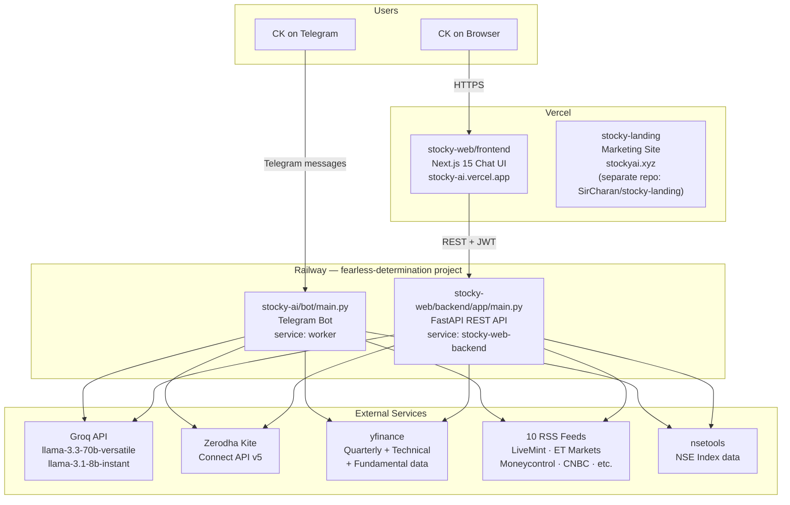
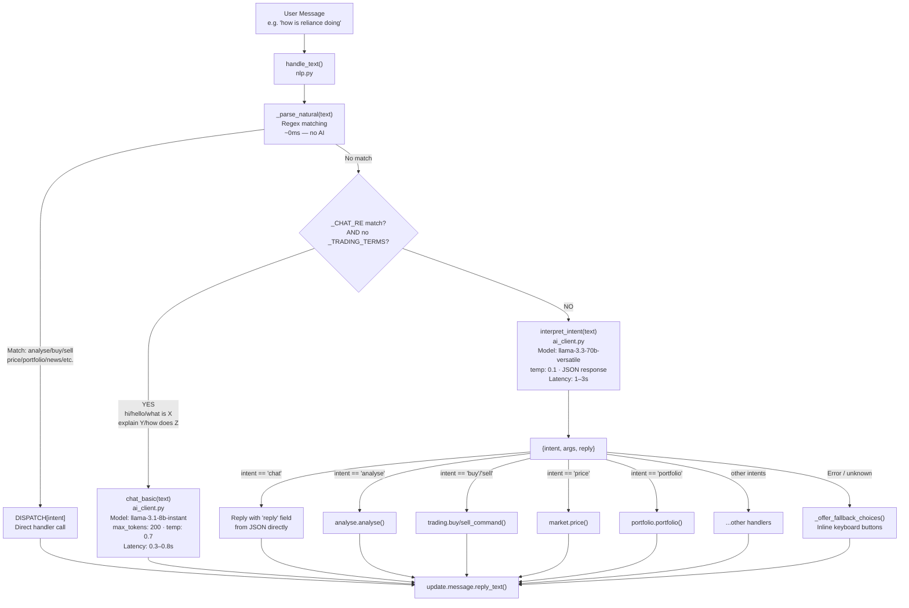
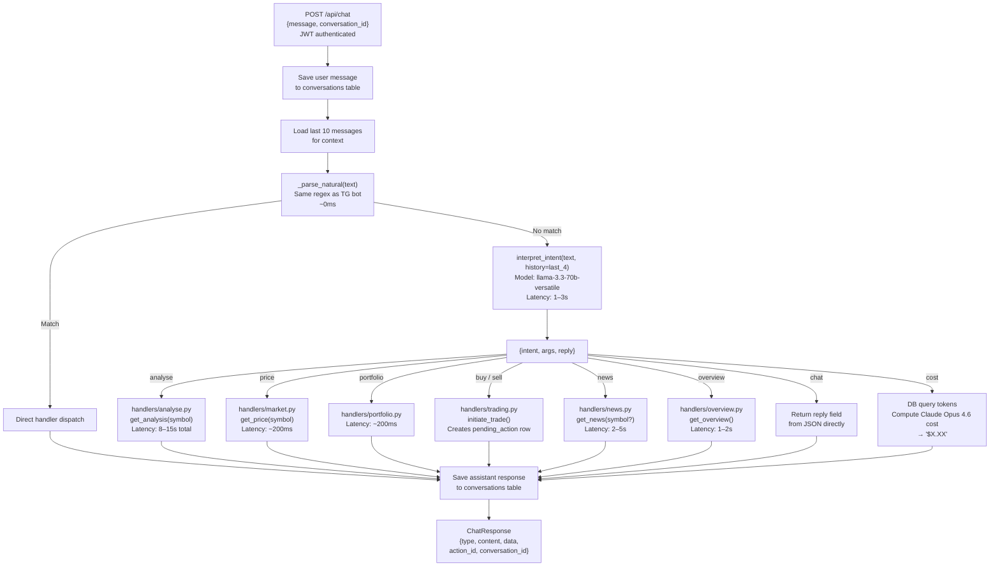
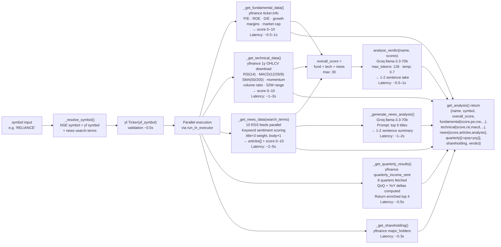
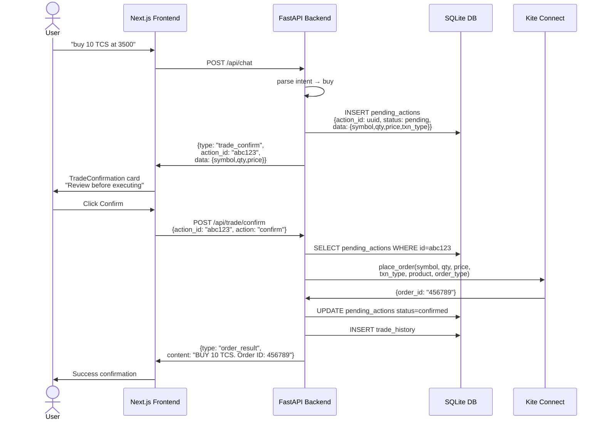
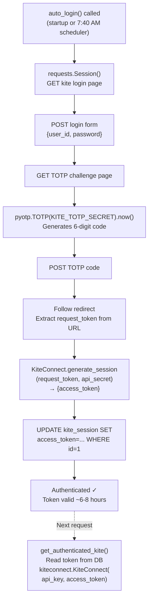
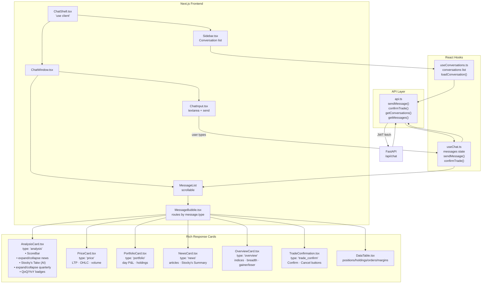
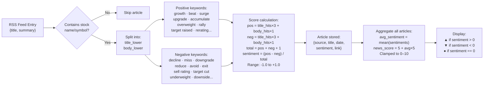

# Stocky AI — Visual Architecture

All diagrams use Mermaid (rendered on GitHub, Notion, and most markdown viewers).

---

## 1. System Overview



---

## 2. Telegram Bot — NLP Pipeline



---

## 3. Web Backend — Chat Dispatch



---

## 4. Stock Analysis Pipeline



---

## 5. Trade Confirmation Flow



---

## 6. Kite Authentication Flow



---

## 7. Frontend Component & Data Flow



---

## 8. Sentiment Scoring — News Articles



---

## 9. Latency Budget Summary

```
User asks: "how is Reliance doing"
─────────────────────────────────────────────────────────────────
Step                               Who            Approx Time
─────────────────────────────────────────────────────────────────
1. NLP intent parsing              Groq 70B       1–3s
2. yfinance validate_ticker        yfinance       0.3–0.5s
3. _get_fundamental_data           yfinance       0.5–1s
4. _get_technical_data (1y OHLCV)  yfinance       1–3s
5. _get_news_data (10 RSS feeds)   feedparser     2–5s  ← bottleneck
6. _get_quarterly_results          yfinance       0.5–1s
7. _get_shareholding               yfinance       0.3s
8. _generate_news_analysis         Groq 70B       1–2s
9. analyse_verdict                 Groq 70B       0.5–1s
─────────────────────────────────────────────────────────────────
Total (steps 2-9 partially parallel):             ~8–15s
─────────────────────────────────────────────────────────────────

User asks: "buy 10 TCS at 3500"
─────────────────────────────────────────────────────────────────
1. Regex NLP match                 local          ~0ms
2. initiate_trade() + DB write     local          ~5ms
─────────────────────────────────────────────────────────────────
Total (to trade_confirm card):                    ~10ms

After confirm click:
3. Kite place_order()              Kite API       100–300ms
─────────────────────────────────────────────────────────────────

User says: "hi"
─────────────────────────────────────────────────────────────────
1. _CHAT_RE match                  local          ~0ms
2. chat_basic()                    Groq 8B        300–800ms
─────────────────────────────────────────────────────────────────
Total:                                            ~0.3–0.8s
```
