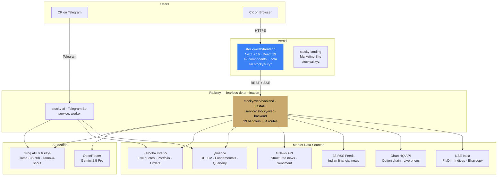
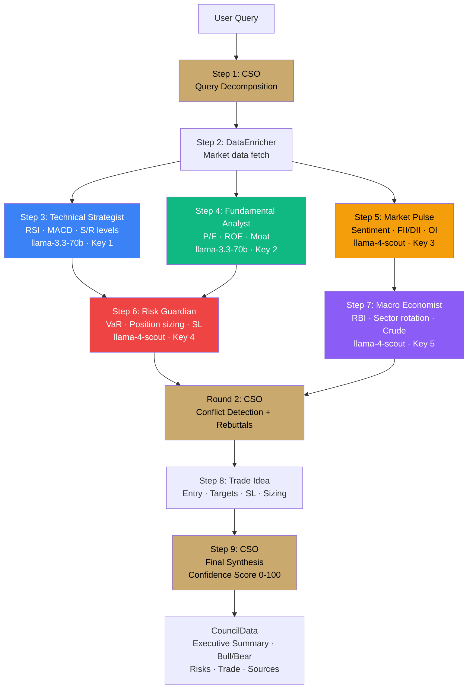
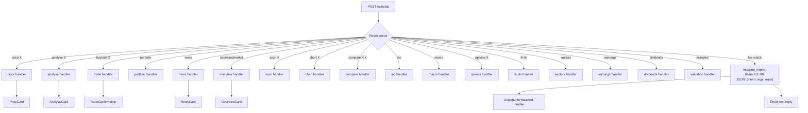
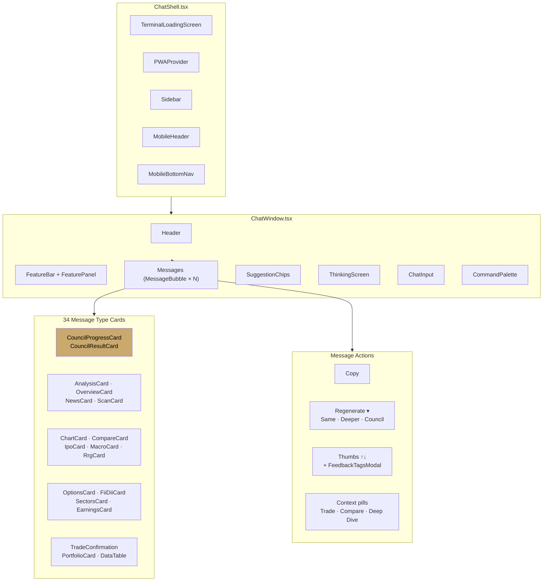
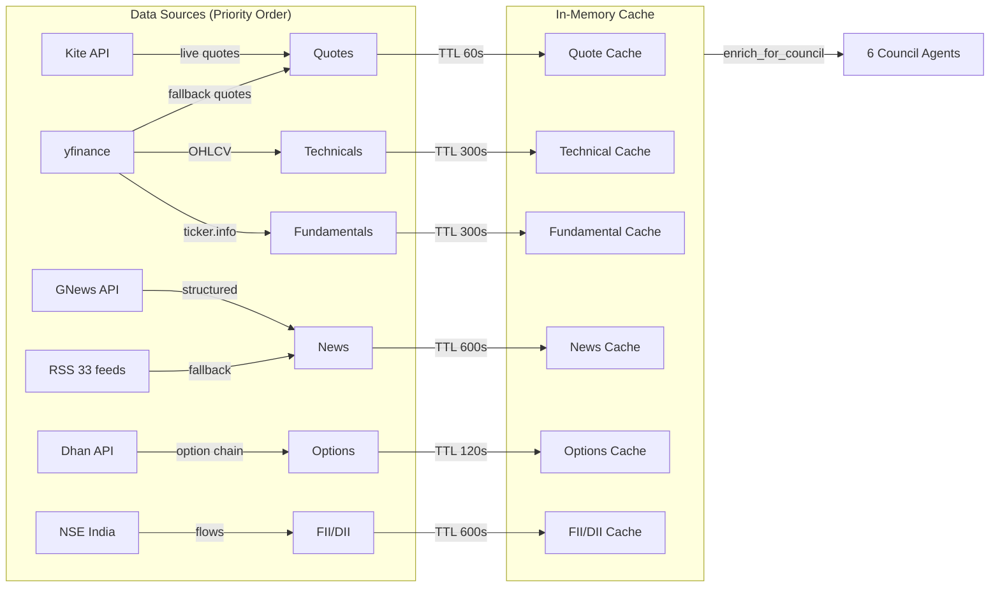
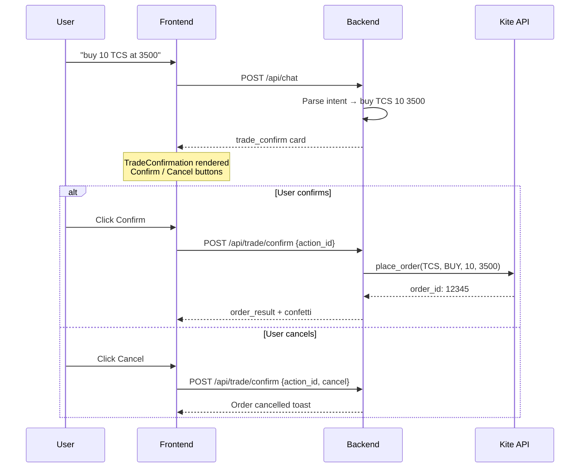
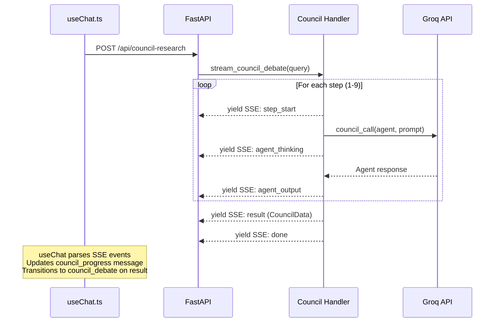
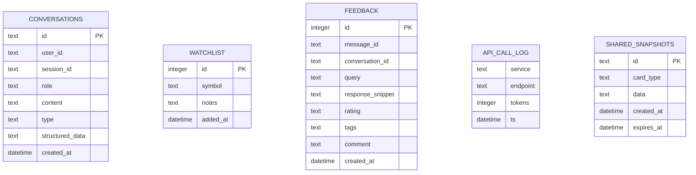
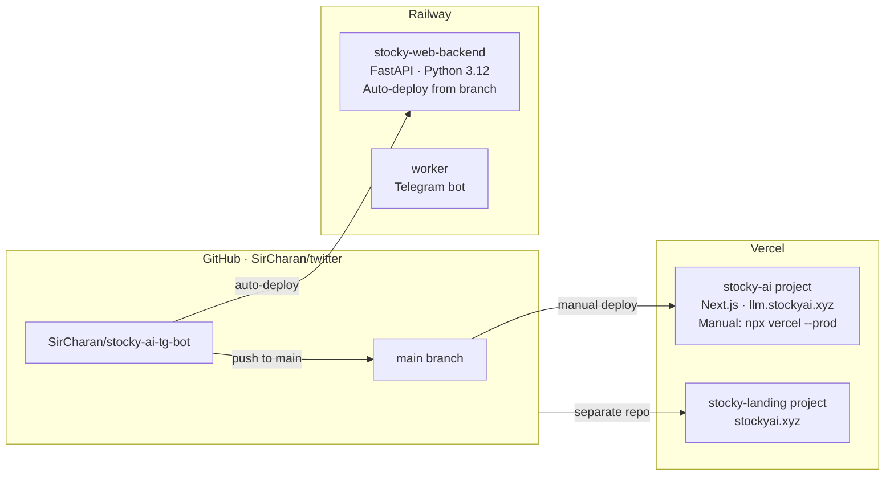

# Stocky AI — Visual Architecture

All diagrams use Mermaid (rendered on GitHub, Notion, and most markdown viewers).

---

## 1. System Overview

---

## 2. 6-Agent Council Architecture

---

## 3. Chat Dispatch (NLP → Handler)

---

## 4. Frontend Component Architecture

---

## 5. Data Enricher Pipeline

---

## 6. Trade Execution Flow

---

## 7. SSE Streaming Architecture

---

## 8. Database Schema

---

## 9. Deployment Architecture

