# Stocky AI — Complete System Documentation

> Every diagram, flow, component, endpoint, and architecture decision in one file.
> All diagrams use [Mermaid](https://mermaid.js.org/) syntax — renders natively on GitHub, Notion, and VS Code.

---

## Table of Contents

1. [System Overview](#1-system-overview)
2. [Technology Stack](#2-technology-stack)
3. [6-Agent Stocky Council](#3-6-agent-stocky-council)
4. [Council Debate Sequence](#4-council-debate-sequence)
5. [Council Execution Timeline](#5-council-execution-timeline)
6. [Chat Message Routing](#6-chat-message-routing)
7. [API Endpoint Map](#7-api-endpoint-map)
8. [Frontend Component Tree](#8-frontend-component-tree)
9. [Message Type → Component Mapping](#9-message-type--component-mapping)
10. [Data Sources & Enricher Pipeline](#10-data-sources--enricher-pipeline)
11. [Trade Execution Flow](#11-trade-execution-flow)
12. [SSE Streaming Architecture](#12-sse-streaming-architecture)
13. [Database Schema](#13-database-schema)
14. [Deployment Architecture](#14-deployment-architecture)
15. [Frontend State Management](#15-frontend-state-management)
16. [Feedback & Regeneration Flow](#16-feedback--regeneration-flow)
17. [PWA & Mobile Architecture](#17-pwa--mobile-architecture)
18. [Environment Variables](#18-environment-variables)
19. [LLM Model Strategy](#19-llm-model-strategy)
20. [File Tree](#20-file-tree)

---

## 1. System Overview

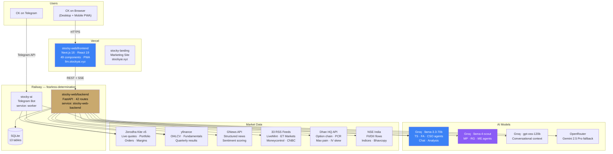

---

## 2. Technology Stack

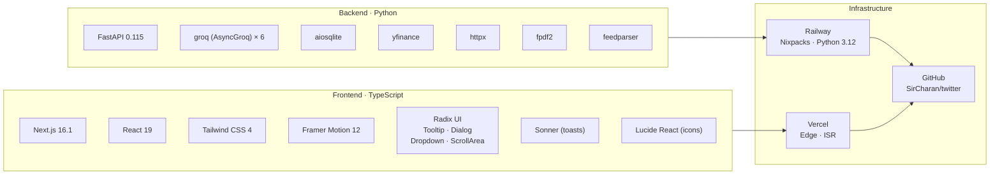

---

## 3. 6-Agent Stocky Council

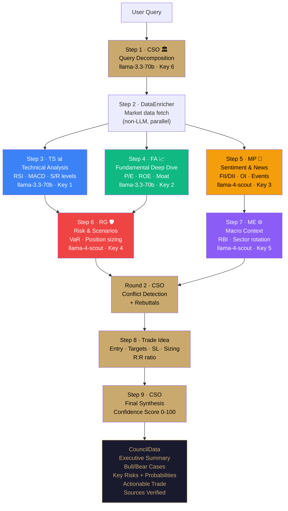

### Agent Details

| Agent | Short | Model | API Key | Colour | Skills |
|-------|-------|-------|---------|--------|--------|
| Technical Strategist | TS | llama-3.3-70b | GROQ_API_KEY | #3b82f6 | Chart patterns, RSI/MACD/Bollinger, Support/Resistance, Entry/Exit |
| Fundamental Analyst | FA | llama-3.3-70b | GROQ_API_KEY_2 | #10b981 | Financial ratios, Earnings quality, Moat analysis, Valuation |
| Market Pulse Agent | MP | llama-4-scout | GROQ_API_KEY_3 | #f59e0b | News sentiment, FII/DII flows, Options chain, Event risk |
| Risk Guardian | RG | llama-4-scout | GROQ_API_KEY_4 | #ef4444 | Position sizing, Stop-loss logic, VaR, Portfolio impact |
| Macro Economist | ME | llama-4-scout | GROQ_API_KEY_5 | #8b5cf6 | RBI policy, Global cues, Sector rotation, Inflation/FX |
| Chief Synthesis Officer | CSO | llama-3.3-70b | GROQ_API_KEY_6 | #c9a96e | Conflict resolution, Confidence scoring, Final recommendation |

---

## 4. Council Debate Sequence

```mermaid
sequenceDiagram
    participant U as User
    participant FE as Frontend (useChat)
    participant API as FastAPI
    participant DE as DataEnricher
    participant CSO as CSO 🏛️
    participant TS2 as TS 📊
    participant FA4 as FA 📈
    participant MP2 as MP 📡
    participant RG2 as RG 🛡️
    participant ME2 as ME 🌐

    U->>FE: Send query (Deep Research mode)
    FE->>API: POST /api/council-research
    Note over FE: Shows CouncilProgressCard

    rect rgb(40, 40, 60)
        Note over API,ME2: ROUND 1: Intelligence Gathering
        API->>CSO: Step 1: Decompose query
        CSO-->>API: Agent tasking plan
        API-->>FE: SSE: council_start + step_start + agent_output

        API->>DE: Step 2: Fetch all market data
        DE-->>API: Quotes + Technicals + News + FII/DII + Options
        API-->>FE: SSE: data_fetch done

        par Parallel Group A (3 keys)
            API->>TS2: Step 3: Technical analysis
            API->>FA4: Step 4: Fundamental deep dive
            API->>MP2: Step 5: Sentiment & news
        end
        TS2-->>API: Technical view
        FA4-->>API: Fundamental view
        MP2-->>API: Market pulse
        API-->>FE: SSE: agent_output ×3

        par Parallel Group B (2 keys)
            API->>RG2: Step 6: Risk & scenarios
            API->>ME2: Step 7: Macro context
        end
        RG2-->>API: Risk assessment
        ME2-->>API: Macro view
        API-->>FE: SSE: agent_output ×2
    end

    rect rgb(60, 40, 40)
        Note over API,ME2: ROUND 2: Debate & Rebuttals
        API->>CSO: Identify conflicts
        CSO-->>API: Conflict list
        API->>RG2: Rebuttal: TS entry level too aggressive
        RG2-->>API: Counter-argument
        API-->>FE: SSE: rebuttal
    end

    rect rgb(40, 60, 40)
        Note over API,CSO: ROUND 3: Final Verdict
        API->>CSO: Step 8: Generate trade idea
        CSO-->>API: Trade setup (entry/SL/targets/sizing)
        API->>CSO: Step 9: Final synthesis
        CSO-->>API: Executive summary + confidence score
        API-->>FE: SSE: result (CouncilData)
    end

    Note over FE: Transitions to CouncilResultCard
    FE->>U: Full report rendered
```

---

## 5. Council Execution Timeline

```mermaid
gantt
    title Council Research (~21 seconds wall-clock)
    dateFormat ss
    axisFormat %Ss

    section Round 1
    CSO Query Decomposition      :cso1, 00, 2s
    DataEnricher Fetch           :data, 01, 3s
    TS Technical Analysis        :ts, 04, 4s
    FA Fundamental Deep Dive     :fa, 04, 4s
    MP Sentiment & News          :mp, 04, 3s
    RG Risk Modeling             :rg, 08, 3s
    ME Macro Context             :me, 08, 3s

    section Round 2
    CSO Conflict Detection       :cso2, 11, 1s
    Rebuttals (1-3)              :reb, 12, 3s

    section Round 3
    CSO Trade Idea               :trade, 15, 3s
    CSO Final Synthesis          :synth, 18, 3s
```

---

## 6. Chat Message Routing

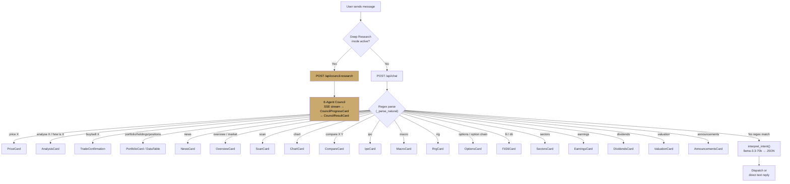

---

## 7. API Endpoint Map

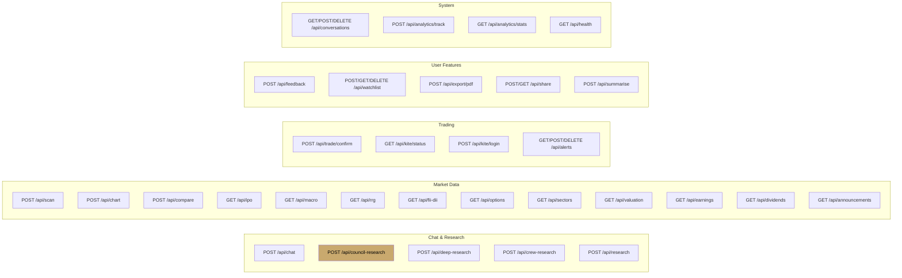

### Complete Route List (42 endpoints)

| Method | Path | Handler | Response |
|--------|------|---------|----------|
| POST | `/api/chat` | `chat()` | JSON (ChatResponse) |
| POST | `/api/council-research` | `council_research_endpoint()` | SSE stream |
| POST | `/api/deep-research` | `deep_research_general()` | SSE stream |
| POST | `/api/crew-research` | `crew_research_endpoint()` | SSE stream |
| POST | `/api/research` | `research_stream()` | SSE stream |
| POST | `/api/trade/confirm` | `trade_action()` | JSON |
| POST | `/api/scan` | `scan_endpoint()` | JSON |
| POST | `/api/chart` | `chart_endpoint()` | JSON |
| POST | `/api/compare` | `compare_endpoint()` | JSON |
| GET | `/api/ipo` | `ipo_endpoint()` | JSON |
| GET | `/api/macro` | `macro_endpoint()` | JSON |
| GET | `/api/rrg` | `rrg_endpoint()` | JSON |
| GET | `/api/fii-dii` | `fii_dii_endpoint()` | JSON |
| GET | `/api/options` | `options_endpoint()` | JSON |
| GET | `/api/sectors` | `sectors_endpoint()` | JSON |
| GET | `/api/valuation` | `valuation_endpoint()` | JSON |
| GET | `/api/earnings` | `earnings_endpoint()` | JSON |
| GET | `/api/dividends` | `dividends_endpoint()` | JSON |
| GET | `/api/announcements` | `announcements_endpoint()` | JSON |
| POST | `/api/feedback` | `submit_feedback()` | JSON |
| POST | `/api/watchlist` | `add_watchlist()` | JSON |
| GET | `/api/watchlist` | `get_watchlist_endpoint()` | JSON |
| DELETE | `/api/watchlist/{symbol}` | `remove_watchlist()` | JSON |
| POST | `/api/export/pdf` | `export_pdf_endpoint()` | PDF binary |
| POST | `/api/share` | `create_share_endpoint()` | JSON |
| GET | `/api/share/{id}` | `get_share_endpoint()` | JSON |
| POST | `/api/summarise` | `summarise_endpoint()` | JSON |
| GET | `/api/conversations` | `list_conversations()` | JSON |
| GET | `/api/conversations/{id}` | `get_conversation()` | JSON |
| DELETE | `/api/conversations/{id}` | `remove_conversation()` | JSON |
| GET | `/api/kite/status` | `kite_status()` | JSON |
| POST | `/api/kite/login` | `kite_login()` | JSON |
| GET | `/api/alerts` | `list_alerts()` | JSON |
| POST | `/api/alerts` | `create_alert_endpoint()` | JSON |
| DELETE | `/api/alerts/{id}` | `delete_alert_endpoint()` | JSON |
| POST | `/api/analytics/track` | `log_analytics_compat()` | JSON |
| GET | `/api/analytics/stats` | `analytics_stats()` | JSON |
| GET | `/api/health` | `health()` | JSON |

---

## 8. Frontend Component Tree

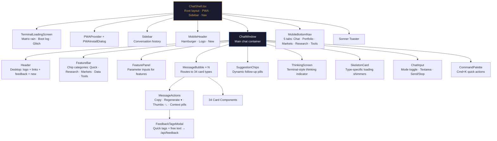

### All 49 Components

| Category | Components |
|----------|-----------|
| **Core** | ChatWindow, ChatInput, MessageBubble, MessageActions, Sidebar, Header, MobileHeader |
| **Council** | CouncilProgressCard, CouncilResultCard |
| **Analysis** | AnalysisCard, DeepResearchCard, AgentDebateCard, DebateProgressCard |
| **Market** | OverviewCard, NewsCard, ScanCard, ChartCard, CompareCard |
| **Data** | OptionsCard, FiiDiiCard, SectorsCard, EarningsCard, DividendsCard, ValuationCard, AnnouncementsCard |
| **Trading** | TradeConfirmation, PortfolioCard, PriceCard, DataTable |
| **Navigation** | FeatureBar, FeaturePanel, MobileBottomNav, CommandPalette, SuggestionChips, SuggestionCard |
| **Loading** | SkeletonCard, ThinkingScreen, TerminalLoadingScreen, ProgressCard, TypingIndicator |
| **UI** | FeedbackModal, FeedbackTagsModal, Confetti, ErrorBoundary, MarkdownRich |
| **PWA** | PWAProvider, PWAInstallDialog |
| **Primitives** | ui/CardWrapper, ui/Tooltip, ui/Dialog, ui/ScrollArea |

---

## 9. Message Type → Component Mapping

```mermaid
graph LR
    subgraph Types["34 Message Types"]
        direction TB
        T1["text"] --> C1["MarkdownRich"]
        T2["analysis"] --> C2["AnalysisCard"]
        T3["overview"] --> C3["OverviewCard"]
        T4["news"] --> C4["NewsCard"]
        T5["portfolio"] --> C5["PortfolioCard"]
        T6["scan"] --> C6["ScanCard"]
        T7["chart"] --> C7["ChartCard"]
        T8["compare"] --> C8["CompareCard"]
        T9["council_progress"] --> C9["CouncilProgressCard"]
        T10["council_debate"] --> C10["CouncilResultCard"]
        T11["options"] --> C11["OptionsCard"]
        T12["fii_dii"] --> C12["FiiDiiCard"]
        T13["trade_confirm"] --> C13["TradeConfirmation"]
        T14["ipo"] --> C14["IpoCard"]
        T15["macro"] --> C15["MacroCard"]
        T16["rrg"] --> C16["RrgCard"]
        T17["sectors"] --> C17["SectorsCard"]
        T18["earnings"] --> C18["EarningsCard"]
        T19["dividends"] --> C19["DividendsCard"]
        T20["valuation"] --> C20["ValuationCard"]
        T21["announcements"] --> C21["AnnouncementsCard"]
        T22["positions/holdings/orders/margins"] --> C22["DataTable"]
        T23["price"] --> C23["PriceCard"]
        T24["deep_research"] --> C24["DeepResearchCard"]
        T25["agent_debate/debate_progress"] --> C25["AgentDebateCard"]
    end

    style T9 fill:#c9a96e,color:#000
    style T10 fill:#c9a96e,color:#000
```

**Full MessageType union (34 types):**
```
text | analysis | portfolio | positions | holdings | orders | margins | price
news | overview | trade_confirm | order_result | alerts | usage | error
deep_research | progress | scan | chart | compare | ipo | macro | rrg
suggestion | agent_debate | debate_progress | earnings | dividends | sectors
valuation | announcements | fii_dii | options | council_progress | council_debate
```

---

## 10. Data Sources & Enricher Pipeline

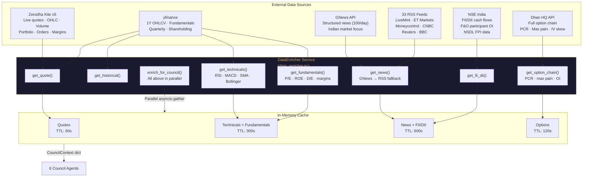

---

## 11. Trade Execution Flow

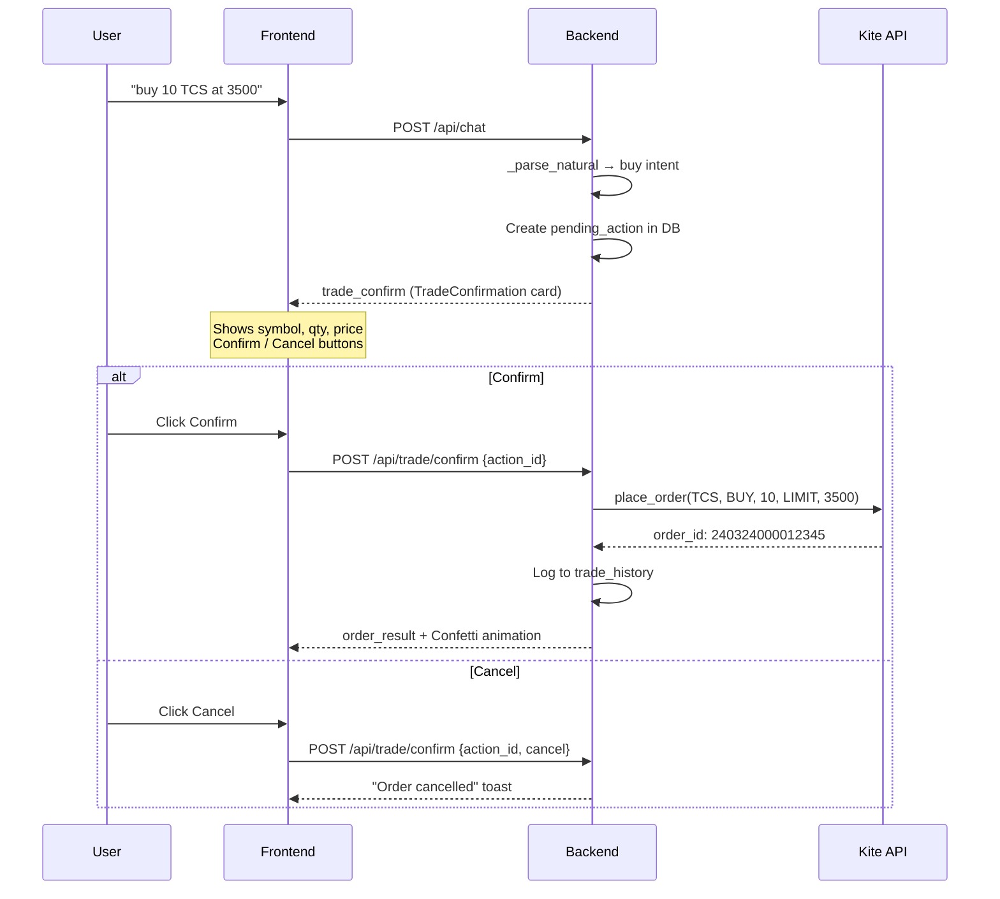

---

## 12. SSE Streaming Architecture

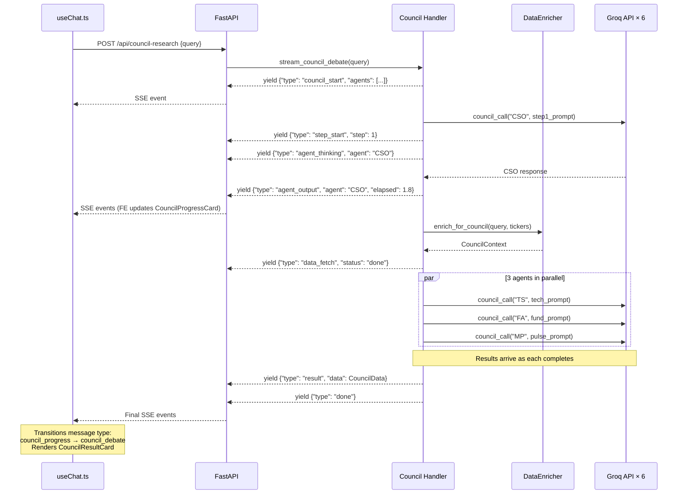

---

## 13. Database Schema

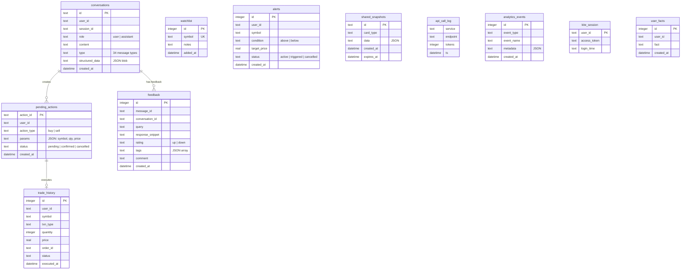

---

## 14. Deployment Architecture

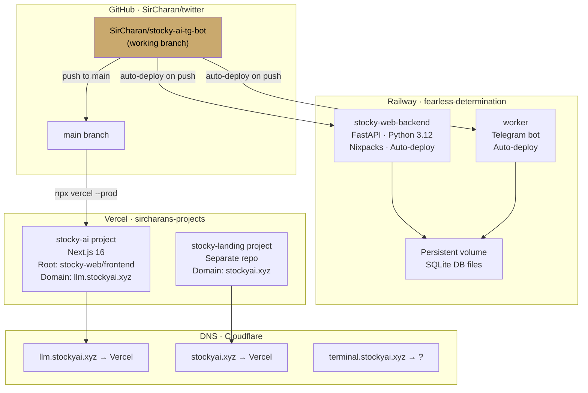

---

## 15. Frontend State Management

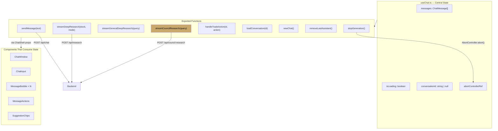

---

## 16. Feedback & Regeneration Flow

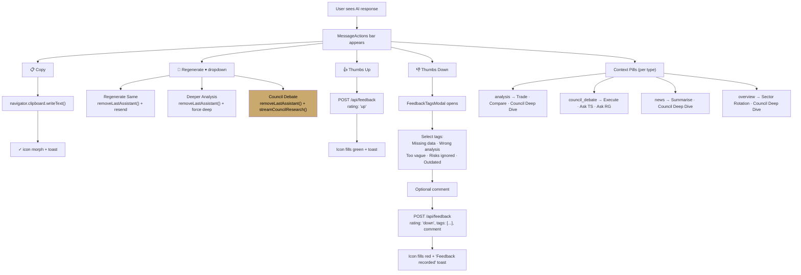

---

## 17. PWA & Mobile Architecture

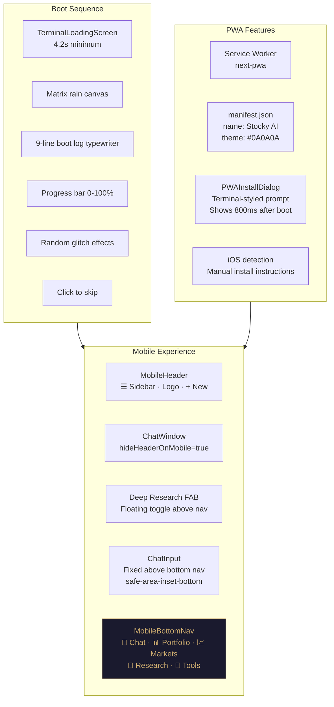

---

## 18. Environment Variables

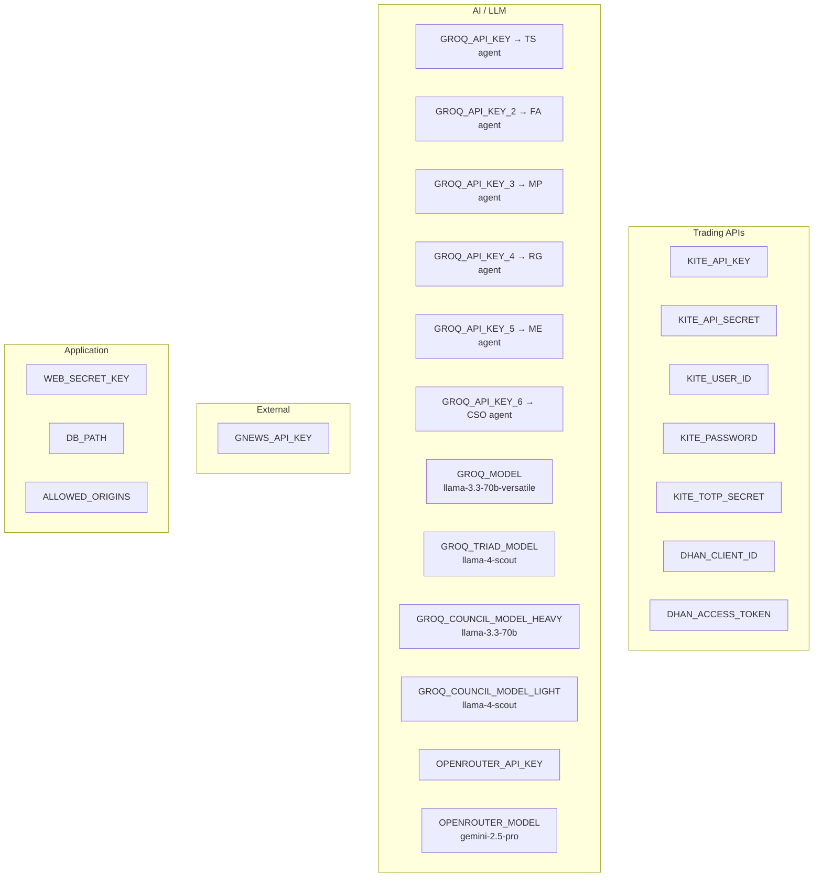

---

## 19. LLM Model Strategy

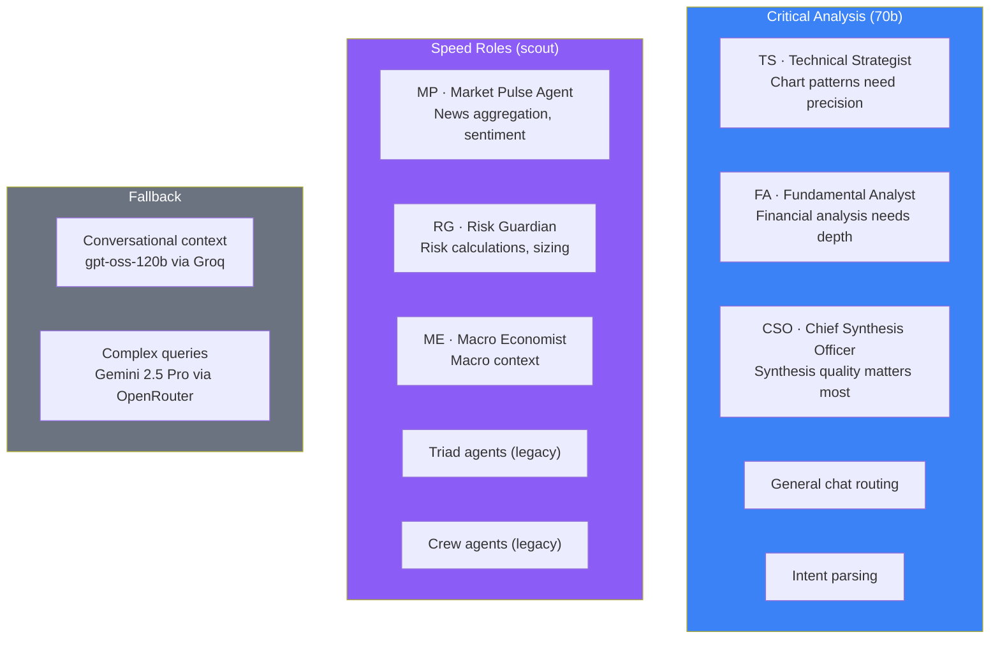

---

## 20. File Tree

```
osaka/
├── stocky-ai/                    Telegram bot
│   ├── bot/
│   │   ├── main.py               Entry point
│   │   ├── ai_client.py          Groq integration
│   │   ├── kite_auth.py          TOTP auto-login
│   │   ├── kite_client.py        Kite wrapper
│   │   ├── database.py           SQLite
│   │   └── handlers/             Command handlers
│   └── requirements.txt
│
├── stocky-web/
│   ├── backend/                  FastAPI REST API
│   │   ├── app/
│   │   │   ├── main.py           42 routes
│   │   │   ├── ai_client.py      6 Groq clients
│   │   │   ├── config.py         25+ env vars
│   │   │   ├── database.py       13 tables
│   │   │   ├── kite_client.py    Zerodha wrapper
│   │   │   ├── handlers/         29 handler modules
│   │   │   │   ├── chat.py       Main chat routing
│   │   │   │   ├── council.py    6-Agent Council ★
│   │   │   │   ├── agent_debate.py  3-Agent Triad
│   │   │   │   ├── crew_research.py 7-Agent Crew
│   │   │   │   ├── analyse.py    Stock analysis
│   │   │   │   ├── overview.py   Market overview
│   │   │   │   ├── news.py       RSS + GNews
│   │   │   │   ├── trading.py    Order execution
│   │   │   │   ├── options.py    Option chain (Dhan)
│   │   │   │   ├── fii_dii.py    FII/DII flows
│   │   │   │   ├── scan.py       Market scanning
│   │   │   │   ├── chart.py      TradingView charts
│   │   │   │   ├── compare.py    Stock comparison
│   │   │   │   ├── ipo.py        IPO tracker
│   │   │   │   ├── macro.py      Macro dashboard
│   │   │   │   ├── rrg.py        Sector rotation
│   │   │   │   ├── sectors.py    Sector performance
│   │   │   │   ├── earnings.py   Earnings calendar
│   │   │   │   ├── dividends.py  Dividend data
│   │   │   │   ├── valuation.py  Market PE/PB
│   │   │   │   ├── announcements.py Corporate actions
│   │   │   │   ├── watchlist.py  Watchlist CRUD
│   │   │   │   ├── export_pdf.py PDF generation
│   │   │   │   ├── share.py      Shareable links
│   │   │   │   ├── portfolio.py  Holdings/positions
│   │   │   │   ├── market.py     Price quotes
│   │   │   │   ├── alerts.py     Price alerts
│   │   │   │   └── deep_research.py  Legacy research
│   │   │   ├── services/
│   │   │   │   └── data_enricher.py  Unified data layer ★
│   │   │   └── prompts/
│   │   │       ├── __init__.py   Base + crew prompts
│   │   │       ├── orchestrator.py  Chat orchestrator
│   │   │       └── council.py    6 agent prompts ★
│   │   ├── .env                  Credentials (gitignored)
│   │   └── requirements.txt
│   │
│   └── frontend/                 Next.js 16 chat UI
│       ├── public/               Static assets
│       └── src/
│           ├── app/
│           │   ├── chat/
│           │   │   ├── ChatShell.tsx       Root layout ★
│           │   │   ├── components/        49 components
│           │   │   │   ├── ChatWindow.tsx  Main container
│           │   │   │   ├── ChatInput.tsx   Mode toggle + input
│           │   │   │   ├── MessageBubble.tsx  Card router
│           │   │   │   ├── MessageActions.tsx Copy/regen/feedback
│           │   │   │   ├── CouncilProgressCard.tsx  Live progress ★
│           │   │   │   ├── CouncilResultCard.tsx    Final report ★
│           │   │   │   ├── FeedbackTagsModal.tsx    Thumbs down tags
│           │   │   │   └── ... (42 more)
│           │   │   └── hooks/
│           │   │       ├── useChat.ts      State + streaming ★
│           │   │       ├── useConversations.ts
│           │   │       ├── useMediaQuery.ts
│           │   │       └── usePWAInstall.ts
│           │   └── ...
│           └── lib/
│               ├── types.ts       34 message types
│               ├── api.ts         42 API functions
│               ├── cn.ts          Class utility
│               └── analytics.ts   Event tracking
│
├── stocky-landing/               Marketing site
│
├── everything.md                 This file ★
├── README.md                     Project overview
├── ai.md                         Deep Research architecture
├── llm.md                        LLM models & routing
├── architecture.md               Visual Mermaid diagrams
├── system-flow.md                End-to-end flowcharts
├── summary.md                    Full technical reference
├── llm.txt                       AI-readable project summary
├── agents.txt                    AI agent navigation guide
└── CLAUDE.md                     Landing page deploy rules
```

---

*Built by [Charandeep Kapoor](https://charandeepkapoor.com) · [stockyai.xyz](https://stockyai.xyz) · March 2026*
