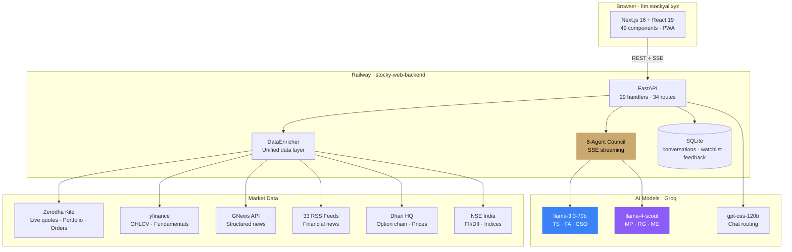
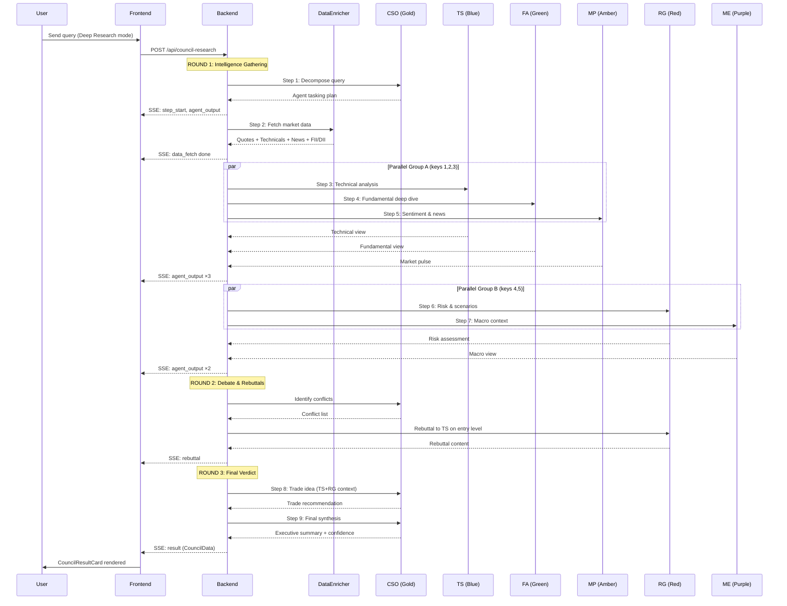
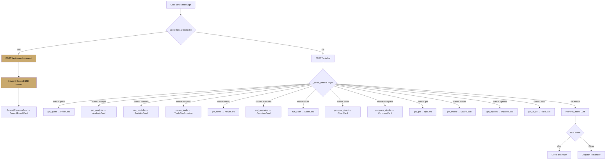
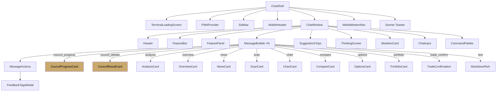
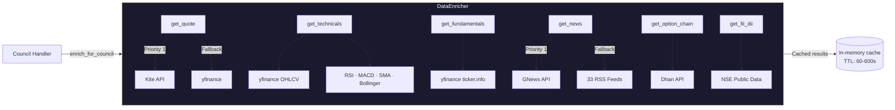
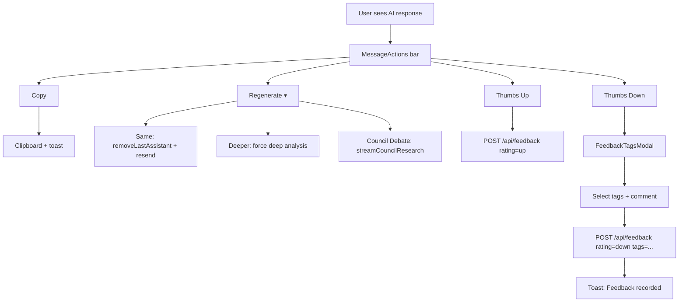

# Stocky AI — System Flow Diagrams

All diagrams use Mermaid syntax (renders on GitHub, Notion, VS Code, etc.).

---

## 1. High-Level System Architecture

---

## 2. 6-Agent Council Debate Flow

---

## 3. Chat Message Routing

---

## 4. Frontend Component Tree

---

## 5. Data Enricher Flow

---

## 6. SSE Streaming Timeline

```mermaid
gantt
    title Council Research Timeline (~21s)
    dateFormat ss
    axisFormat %Ss

    section Round 1
    CSO: Query Decomposition     :cso1, 00, 2s
    Data Fetch                   :data, 01, 3s
    TS: Technical Analysis       :ts, 04, 4s
    FA: Fundamental Deep Dive    :fa, 04, 4s
    MP: Sentiment & News         :mp, 04, 3s
    RG: Risk Modeling            :rg, 08, 3s
    ME: Macro Context            :me, 08, 3s

    section Round 2
    CSO: Conflict Detection      :cso2, 11, 1s
    Rebuttals (1-3)              :reb, 12, 3s

    section Round 3
    CSO: Trade Idea              :trade, 15, 3s
    CSO: Final Synthesis         :synth, 18, 3s
```

---

## 7. Message Type → Component Mapping

```mermaid
graph LR
    subgraph MessageTypes["34 Message Types"]
        T1[text] --> MR2[MarkdownRich]
        T2[analysis] --> AC2[AnalysisCard]
        T3[overview] --> OC3[OverviewCard]
        T4[news] --> NC2[NewsCard]
        T5[portfolio] --> PC2[PortfolioCard]
        T6[scan] --> SC2[ScanCard]
        T7[chart] --> CC2[ChartCard]
        T8[compare] --> CPC2[CompareCard]
        T9[council_progress] --> CPR2[CouncilProgressCard]
        T10[council_debate] --> CRC2[CouncilResultCard]
        T11[trade_confirm] --> TC2[TradeConfirmation]
        T12[options] --> OPC2[OptionsCard]
        T13[fii_dii] --> FDC[FiiDiiCard]
        T14[ipo] --> IC[IpoCard]
        T15[macro] --> MC[MacroCard]
        T16[rrg] --> RC[RrgCard]
        T17[sectors] --> SEC[SectorsCard]
        T18[earnings] --> EC[EarningsCard]
        T19[dividends] --> DC[DividendsCard]
        T20[valuation] --> VC[ValuationCard]
    end

    style T9 fill:#c9a96e,color:#000
    style T10 fill:#c9a96e,color:#000
```

---

## 8. Feedback & Regeneration Flow

